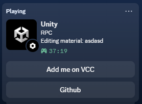
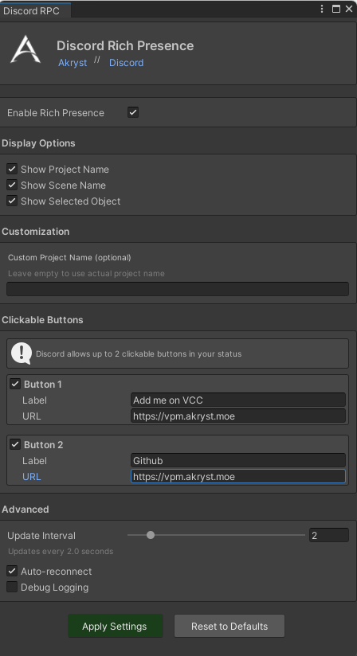

<div align="center">


# Unity Editor Discord Rich Presence

**Show your Unity development activity on Discord**

[](https://github.com/Akryst/Unity-Discord-RPC)
[](https://unity.com)
[](LICENSE.md)

[Installation](#installation) • [Features](#features) • [Settings](#settings) • [Discord](https://discord.akryst.moe)

---



*Show off what you're working on in real-time*

</div>

## Features

- **Live Activity Updates** - Shows your current project, scene, and selected object
- **Session Tracking** - Displays how long you've been working
- **Smart Detection** 
  - Play/Edit mode
  - Scene changes
  - GameObject selection
  - Material and mesh editing
  - Build and upload progress (VRChat SDK support)
- **Clickable Buttons** - Add up to 2 custom buttons with links
- **Highly Customizable** - Full settings window with live preview
- **Lightweight** - Only 343KB, 100% managed C# code
- **Zero Configuration** - Works out of the box

## Installation

### Via VPM (Recommended)

1. Add Akryst's VPM repository:
   ```
   https://vpm.akryst.moe
   ```
2. Install **Unity Editor Discord Rich Presence** from VCC

### Manual Installation

1. Open Unity Package Manager
2. Click **+ → Add package from git URL**
3. Enter:
   ```
   https://github.com/Akryst/Unity-Discord-RPC.git
   ```

## Quick Start

1. **Install the package** using one of the methods above
2. **Open Discord** (must be running before Unity)
3. **Open Unity** - Rich Presence activates automatically
4. That's it! Check your Discord profile

<div align="center">


*Customize everything in `Window → Discord RPC Settings`*
</div>

## Settings

Access settings via **Window → Discord RPC Settings**

### Display Options
- ☑️ **Show Project Name** - Display your project in Discord
- ☑️ **Show Scene Name** - Display current scene
- ☑️ **Show Selected Object** - Display selected GameObject/asset
- **Custom Project Name** - Override default project name

### Clickable Buttons
Add up to 2 buttons to your Discord status:
- **Button 1** - Default: "Add me on VCC" → VPM repository
- **Button 2** - Optional: Add GitHub, website, or custom link

### Advanced
- **Update Interval** - How often to update Discord (1-10 seconds)
- **Auto-reconnect** - Reconnect if Discord restarts
- **Debug Logging** - Show detailed logs in Console

### Status Indicator
- 🟢 **Green** - Connected to Discord
- 🔴 **Red** - Disconnected (Discord not running or connection failed)

## Requirements

- **Unity** 2019.4 or newer
- **Discord** Desktop app (must be running)
- **Platforms**: Windows, Linux

## Troubleshooting

### Status not appearing?
1. Make sure Discord is running **before** opening Unity
2. Check Discord settings: `User Settings → Activity Privacy → Display current activity` ✓
3. Wait 2-5 seconds for initial connection
4. Check Unity Console for errors

### "Discord not running" warning?
- Start Discord, then restart Unity
- The plugin only initializes if Discord is already running

## Changelog

See [CHANGELOG.md](CHANGELOG.md) for full release history.

### v2.0.0 Highlights
- **98% smaller** - Migrated to lightweight discord-rpc-csharp library
- **Settings window** - Full customization UI
- **Selected object detection** - Shows what you're editing
- **Clickable buttons** - Add custom links
- **Memory leak fixes** - Better thread safety and cleanup

## Contributing

Found a bug or have a feature request? 

- [Open an issue](https://github.com/Akryst/Unity-Discord-RPC/issues)
- [Join our Discord](https://discord.akryst.moe)

## License

MIT License - See [LICENSE.md](LICENSE.md)

## Credits

This package uses [discord-rpc-csharp](https://github.com/Lachee/discord-rpc-csharp) by Lachee for Discord Rich Presence communication.

## Links

- **VPM Repository**: [vpm.akryst.moe](https://vpm.akryst.moe)
- **Website**: [akryst.moe](https://akryst.moe)
- **Discord**: [discord.akryst.moe](https://discord.akryst.moe)
- **GitHub**: [github.com/Akryst/Unity-Discord-RPC](https://github.com/Akryst/Unity-Discord-RPC)

---

<div align="center">

Made with ❤️ by [Akryst](https://akryst.moe)

Perfect for **VRChat creators** and **Unity developers**

</div>
